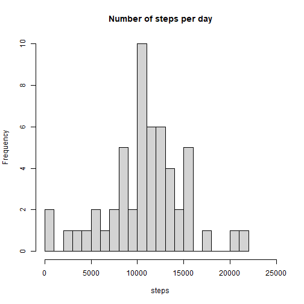
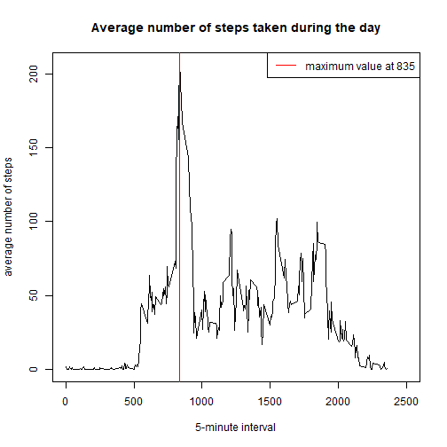
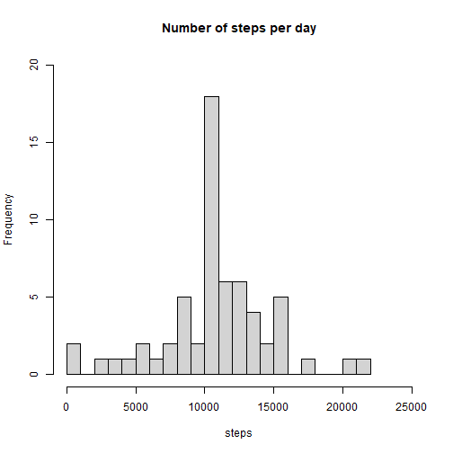

# Reproducable Research: "Peer Assessment 1"

For this project data from a personal activity monitoring device are used. The device collects data at 5 minute intervals through out the day. The data consist of two months of data from an anonymous individual collected during the months of October and November, 2012 and include the number of steps taken in 5 minute intervals each day. 

The data set can be downloaded here: [Activity:monitoring_data [52K]](https://d396qusza40orc.cloudfront.net/repdata%2Fdata%2Factivity.zip)

The variables included in the dataset are:

- **steps**: Number of steps taking in a 5-minute interval
- **date**: The date on which the measurement was taken in YYYY-MM-DD format
- **interval**: Identifier for the 5-minute interval in which measurement was taken

## What is mean total number of steps taken per day?

The histogram shows the total number of steps taken each day. For this part the missing values in the dataset are ignored.


```r
## read date
unzip("./activity.zip")
dat <- read.csv("activity.csv")
data <- na.omit(dat)
data$date <- as.Date(data$date)

## create histogram
library(dplyr)
result <- group_by(data, date) %>% summarise(sum(steps))
hist(result$`sum(steps)`, breaks = 20, xlim = c(0, 25000),
     main = "Number of steps per day", xlab = "steps")
```




The mean and the median total number of steps taken per day were calculated.


```r
Mean <- mean(result$`sum(steps)`)
Median <- median(result$`sum(steps)`)
```

These are the results:  

**mean** = 1.0766189 &times; 10<sup>4</sup>   
**median** = 10765  


## What is the average daily activity pattern?


```r
library(dplyr)
result2 <- group_by(data, interval) %>% summarise(mean(steps))
m <- max(result2$`mean(steps)`)
ma <- filter(result2, `mean(steps)` == m)

plot(result2$interval, result2$`mean(steps)`, type = "l", xlim = c(0,2500),
     main = "Average number of steps taken during the day", 
     xlab = "5-minute interval", ylab = "average number of steps")
abline(v = ma$interval, col = "red")
legend("topright", lty = 1, col = "red", paste("maximum value at", ma$interval))
```



A time series plot of the average number of steps taken during the day (averaged over all days) shows that the interval at 835 contains the maximum number of steps taken durin the day.


### Imputing missing values

In the dataset there are a number of days/intervals where there are missing values, which may introduce bias into some calculations or  summaries of the data.


```r
nr <- length(dat$steps) - length(data$steps)
```

The number of missing values in the dataset is 2304.

In order to fill in the missing values the average steps taken in a 5-minute interval during all days were used and a new dataset created.


```r
data2 <- dat
for (i in seq(data2$steps)){
if (is.na(data2$steps[i])) {
  s <- filter(result2, interval == data2$interval[i])
  data2$steps[i] <- s$`mean(steps)`
}}
```


The histogram shows the result for the corrected data.


```r
## histogram of data2
  
result3 <- group_by(data2, date) %>% summarise(sum(steps))
Mean2 <- mean(result3$`sum(steps)`)
Median2 <- median(result3$`sum(steps)`)
hist(result3$`sum(steps)`, breaks = 20, xlim = c(0, 25000), ylim = c(0,20),
     main = "Number of steps per day", xlab = "steps")
```



The **mean** of the total number of steps now is 1.0766189 &times; 10<sup>4</sup>, the **median** is 1.0766189 &times; 10<sup>4</sup>.  

Mean and median are now identical. The bar with the highest frequency ( ~ 10000-11000) increased.


## Are there differences in activity patterns between weekdays and weekends?

In the last step the activity patterns between weekdays and weekends were compared. 


```r
data2$date <- as.Date(data2$date)
weekd <- c("Montag", "Dienstag", "Mittwoch", "Donnerstag", "Freitag")
data3 <- mutate(data2, weekday = weekdays(data2$date), w = ifelse(weekday %in% weekd, "weekday", "weekend"))
data_wd <- subset(data3, w == "weekday") %>% group_by(interval) %>% summarise(mean(steps), first(w))
data_we <- subset(data3, w == "weekend") %>% group_by(interval) %>% summarise(mean(steps), first(w))
data5 <- rbind(data_wd, data_we)
library(lattice)
xyplot(`mean(steps)` ~ interval | `first(w)`, data = data5, type = "l", layout = c(1,2), ylab = "Number of steps", xlab = "Interval")
```


